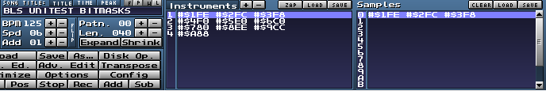
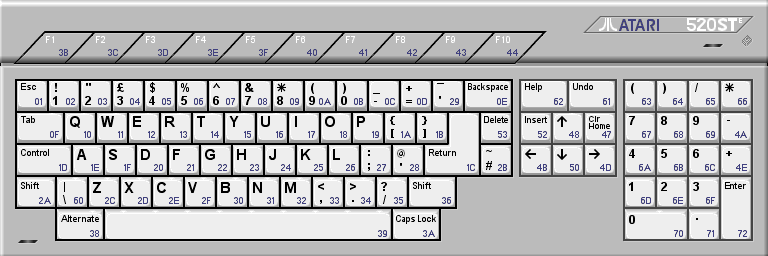
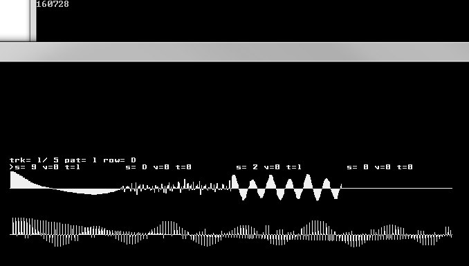
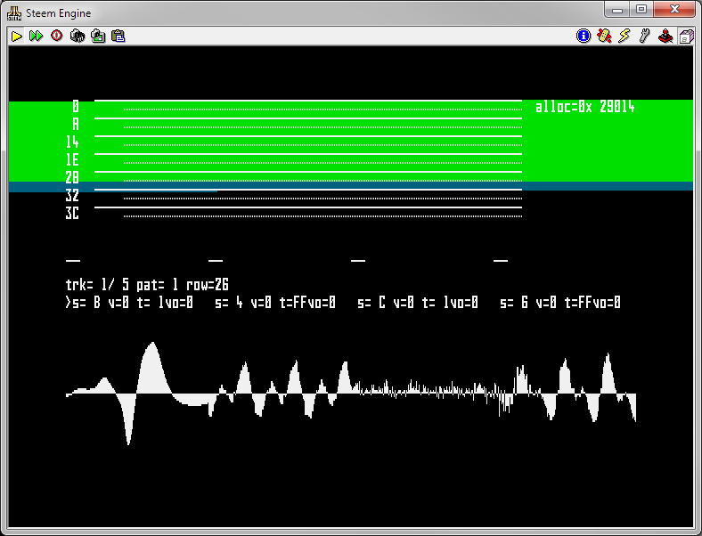

# BLITSnd

## Workflow

Currently BLITSnd uses 2 programs :

*   BLSconvert : this program will load a standard Protracker .MOD file,
    analyze and convert it into .BLS format that can be played
    by BLITSnd replay routine. This program is a console C++ program and
    is currently compiled for PC-win32.
*   BLSplay : BLITSnd player loads a .BLS file and plays it. This
    program is a PC-win32 / ST portable program.
	
You can edit your .MOD file using a regular soundtracker following a set of constraints and 
check how it converts through BLSconvert and renders with BLSplay from time to time.
If you use special effects only managed by BLITSnd (like bit masking) you will not be able to listen
to them directly into the soundtracker.

Binary versions are available :
*    in PC\Debug for PC 
*    at root for Atari ST  

**!!! they are delivered without any warranty (virus...), for your safety it is better to recompile them... !!!**

### BLSconvert

The converter gives you heavy feedback on the source .MOD conversion,
instrument pre-transposition, FX use... Do not hesitate to redirect its
output into a text file for further reading. You can do a batch file
where you will drag and drop your MOD file... BLSconvert also gives an
estimation of the memory used by samples storage for playing.

```
    blsconvert %1 [parameters] > output.txt
    notepad++ output.txt
```

Command line parameters:

* *-test* activates autotest mode (more information in *development* section). 
  Not to be set for regular use.

* *-amigapal* to use 8287.1369 hz as reference for C2 key. Default is
  Amiga NTSC freq reference with is 8363.4229 hz for C2 key.
  Fasttracker and Milkytracker use NTSC reference.

* *-v1* will convert Cxx volume effect differently :
    * odd values (from 1 to 63) will configure STe balance while even
      values (from 0 to 64) will configure sample volume
    * else (in default mode) 8xx effects are converted as STe balance, 
	  Cxx effects as sample volume effects

Example of conversion log for the great QUICKIE.MOD :

*Data read from input module*

```
Source module size = 23328
Title = 10minutetrash

Sample name               | Length | FineTune| Volume |LoopStrt|LoopLen
1: ~quickie intro song1   | 1886   | 0       | 64     | 1758   | 128 
2: by   mekkannik/btl     | 5088   | 0       | 64     | 0      | 0 
3: call outland bbs!      | 4752   | 0       | 64     | 0      | 0 
4:   602-872-1617         | 2034   | 0       | 22     | 0      | 0 
5: i can be found there   | 0      | 0       | 0      | 0      | 0 
6: leeching daily! haha   | 4388   | 0       | 64     | 0      | 0 
7: so call it up! byez..  | 0      | 0       | 0      | 0      | 0 
8:                        | 0      | 0       | 0      | 0      | 0 
...
31:                       | 0      | 0       | 0      | 0      | 0 

Song length = 5
RestartSongLooping = 0

0: 0 1 1 2 3 0 0 0
8: 0 0 0 0 0 0 0 0
...
120: 0 0 0 0 0 0 0 0

M.K.

Nb saved patterns 4

Pattern 0

0:  G 1 1 [0 0 0] | - 0 [c 0 0] | - 0 [c 0 0] | C 3 2 [f 0 9]
1:  - 0   [0 0 0] | - 0 [0 0 0] | - 0 [0 0 0] | - 0   [f 0 6]
2:  - 0   [0 0 0] | - 0 [0 0 0] | - 0 [0 0 0] | A 3 4 [f 0 9]
3:  - 0   [0 0 0] | - 0 [0 0 0] | - 0 [0 0 0] | C 3 2 [f 0 6]
4:  G 2 1 [0 0 0] | - 0 [0 0 0] | - 0 [0 0 0] | C 3 3 [f 0 9]
5:  G 1 1 [0 0 0] | - 0 [0 0 0] | - 0 [0 0 0] | - 0   [f 0 6]
6:  - 0   [0 0 0] | - 0 [0 0 0] | - 0 [0 0 0] | A 3 4 [f 0 9]
7:  G 2 1 [0 0 0] | - 0 [0 0 0] | - 0 [0 0 0] | C 3 2 [f 0 6]
8:  A#2 1 [0 0 0] | - 0 [0 0 0] | - 0 [0 0 0] | - 0   [f 0 9]
9:  A#1 1 [0 0 0] | - 0 [0 0 0] | - 0 [0 0 0] | C 3 3 [f 0 6]
10: C 2 1 [0 0 0] | - 0 [0 0 0] | - 0 [0 0 0] | C 3 2 [f 0 9]
11: D 2 1 [0 0 0] | - 0 [0 0 0] | - 0 [0 0 0] | - 0   [f 0 6]
12: - 0   [0 0 0] | - 0 [0 0 0] | - 0 [0 0 0] | C 3 3 [f 0 9]
13: F 2 1 [0 0 0] | - 0 [0 0 0] | - 0 [0 0 0] | A 3 4 [f 0 6]
14: C 2 1 [0 0 0] | - 0 [0 0 0] | - 0 [0 0 0] | C 3 2 [f 0 9]
15: A#1 1 [0 0 0] | - 0 [0 0 0] | - 0 [0 0 0] | - 0   [f 0 6]
16: D#1 1 [0 0 0] | - 0 [0 0 0] | - 0 [0 0 0] | C 3 2 [f 0 9]
17: - 0   [0 0 0] | - 0 [0 0 0] | - 0 [0 0 0] | - 0   [f 0 6]
18: - 0   [0 0 0] | - 0 [0 0 0] | - 0 [0 0 0] | A 3 4 [f 0 9]
19: - 0   [0 0 0] | - 0 [0 0 0] | - 0 [0 0 0] | C 3 2 [f 0 6]
...
```

*List of different keys found into the module*

```
Instrument keys used...

Instr = 1 - Key D 1
Instr = 1 - Key D# 1
Instr = 1 - Key G 1
Instr = 1 - Key A# 1
Instr = 1 - Key C 2
Instr = 1 - Key D 2
Instr = 1 - Key D# 2
Instr = 1 - Key F 2
Instr = 1 - Key G 2
Instr = 1 - Key A# 2
Instr = 2 - Key C 3
Instr = 3 - Key C 3
Instr = 4 - Key A 3
Instr = 6 - Key C 2
Instr = 6 - Key D 2
Instr = 6 - Key F 2
Instr = 6 - Key G 2
Instr = 6 - Key A 2
Instr = 6 - Key A# 2
Instr = 6 - Key C 3
Instr = 6 - Key D 3
Instr = 6 - Key D# 3
Instr = 6 - Key F 3
Instr = 6 - Key F# 3
Instr = 6 - Key G 3
Instr = 6 - Key A 3
Instr = 6 - Key A# 3
```

*Pre-tranposed keys table for each instrument*

* *Instr = sample number (source sample byte length)*
* *precomputed keys : [octave/semitone (transposed sample nb bytes) > storage divider shift]*
* *keys dynamically transposed from existing precomputed keys : {octave/semitone > octave shift}*

```
Instrument precompute...

Instr = 1 ( 1886): [1/2 (10137) >0] [1/3 (9568) >0] [1/7 (7594) >0] [1/10 (6386) >0] [2/0 (5689) >0] {2/2 >1} {2/3 >1} [2/5 (4262) >0] {2/7 >1} {2/10 >1}
Instr = 2 ( 5088): [3/0 (7674) >0] 
Instr = 3 ( 4752): [3/0 (7167) >0]
Instr = 4 ( 2034): [3/9 (1824) >0]
Instr = 6 ( 4388): [2/0 (6618) >-1] [2/2 (5896) >-1] [2/5 (4958) >-1] [2/7 (4417) >-1][2/9 (7870) >0] [2/10 (7429) >0] {3/0 >0} {3/2 >0} [3/3 (5565)>0] {3/5 >0} [3/6 (4680) >0]{3/7 >0} {3/9 >1} {3/10 >1}
```

*Cumulated byte size for all precomputed samples of an instrument*
* *If volume effect is used, instrument uses 16 bits to store each byte of the sample, else 8 bits only
  =\> it impacts the computed byte size of the instrument*

```
instrument 1 size = 43636 no volume effect found
instrument 2 size = 7674  no volume effect found
instrument 3 size = 7167  no volume effect found
instrument 4 size = 1824  no volume effect found
instrument 6 size = 94868 volume used
```

*Estimated total size used by samples in memory when .BLS file will be loaded*

```
total size = 155169 for 17 precomputed samples and 27 keys
```

*A heap of a size of max of these two values will be allocated for samples at init of the BLITsnd player (sizes for even addresses / odd addresses heaps)*

```
heapsize 154512 155884
```

#### Sample section

*   **Sample volume**: fixed volume defined into sample section is applied
    statically at module conversion. So if you want to lower the sample
    volume at once for all keys, do it there. It has no cost in terms of
    memory footprint.
*   **Sample fine tune** for -8 to +8 in semitones / 8. In MilkyTracker
    value goes from -128 to 128 =\> you have to step by 16 increments.
*   **Source sample length** is limited to 64k but destination transposed
    samples may exceed 64k except for instruments using arpeggio effect.
    When using arpeggio, destination transposed samples may not exceed
    64k.
*   **Sample loop length** should not exceed 16k in the transposed sample
    (more constraining than standard .MOD format). BLSconvert will output
    a warning if the size value is over this limit.
*   **Sample name** : naming convention in samples change the behaviour of
    the converter

    -   Instrument which names begins by :

        -   **\~0** will not be transposed meaning all keys for this
            instrument will use the same sample. This one should be
            sampled at 25khz which is the replay frequency. This can be
            useful for high quality drums

        -   **\~2** requires linear interpolation when pre-transposing
            corresponding sample instead of closer byte method.  
			Warning: this setting disable storage divider optimization for 
			the current sample (you should only use it if it really makes a difference
			in terms of quality) !

        -   **\~2:\<size in bytes\>** the sample will be transposed
            linearly interpolated in a way that destination sample will
            be *\<size in bytes\>* size.  
			All keys of this instrument will use the same sample. 
			This setting can be useful if you want to store
            a long looping sample that exceed 16KB =\> you cannot use
            looping sample in this case.  
			Having a fixed destination size allows to loop synchronously 
			score and sample (500 bytes are played each frame). 
			Look at test module DATA\UNITTEST\LONGLOOP.MOD/BLS as example.  
			Of course in this case tuning your sample may be complicated (time stretching ?)

        -   **\~1:\<size in bytes\>** same than \~2 but using direct
            transposition without interpolation... 
			(does not disable storage divider optimization)

    -   You can put tags \#\$XYY into instruments list names to specify
        bitmasks values (look at 0xE0X effect for more info).  
		- X is the bitmask : 1 to 0xE, 0 is reserved as no mask value =\>
        0xFFFF
		- YY the one byte sample mask value
		(Please note X and Y are hexadecimal values)

        

        If you do not customize bit masks, default values will be used by OxE0 effect :

        ```
        bitmask [0x0] = FFFF 
        bitmask [0x1] = FEFE 
        bitmask [0x2] = FCFC 
        bitmask [0x3] = F8F8 
        bitmask [0x4] = F0F0 
        bitmask [0x5] = E0E0 
        bitmask [0x6] = C0C0 
        bitmask [0x7] = 8080 
        bitmask [0x8] = EEEE 
        bitmask [0x9] = CCCC 
        bitmask [0xA] = 8888 
        bitmask [0xB] = 7F7F 
        bitmask [0xC] = 3F3F 
        bitmask [0xD] = 1F1F 
        bitmask [0xE] = 0F0F 
        bitmask [0xF] = 0000 
        ```

#### Patterns FX

.MOD score defines keys but also effects. These effects are only partially
supported by BLITSnd.  
* Freq, volume slides... effects are not supported by BLITSnd (portamiento
in particular)
* Some effects entries are used differently by BLITSnd

Here is the list of effects that can be used :

-   **0x0XY** : arpeggio for chiptune style ;) (samples using arpeggio should not 
    exceed 64KB once transposed !)

-   **0x8XX** : balance (when not using -v1 volume conversion mode !) =\>
    panning effect is used for balance (different but gives an idea if
    you listen to only left or right channel). Also in modern mod
    trackers you have an option to ignore 0x8 FX.
    -   For voice 1 & 3, use 0x880 to 0x8FF to set left volume
    -   For voice 2 & 4, use 0x87F to 0x800 to set right volume
    -   If you use two effects 0x8 on voices of same channel on the same
        division, the last in voice order will be considered
    -   Values are rounded to sets volume at STe LMC balance resolution
        of -2db steps.  
		XX value determines 0 to 127 range for each side.
        This value is divided by 2 and goes through this table to obtain
        the equivalent STe balance channel value (you can see resolution
        in the high volume is very low).

```
| 0  (0x00) -40db | 32 (0x20) -6db |
| 1  (0x01) -36db | 33 (0x21) -6db |
| 2  (0x02) -30db | 34 (0x22) -6db |
| 3  (0x03) -26db | 35 (0x23) -6db |
| 4  (0x04) -24db | 36 (0x24) -6db |
| 5  (0x05) -22db | 37 (0x25) -4db |
| 6  (0x06) -20db | 38 (0x26) -4db |
| 7  (0x07) -20db | 39 (0x27) -4db |
| 8  (0x08) -18db | 40 (0x28) -4db |
| 9  (0x09) -18db | 41 (0x29) -4db |
| 10 (0x0A) -16db | 42 (0x2A) -4db |
| 11 (0x0B) -16db | 43 (0x2B) -4db |
| 12 (0x0C) -14db | 44 (0x2C) -4db |
| 13 (0x0D) -14db | 45 (0x2D) -4db |
| 14 (0x0E) -14db | 46 (0x2E) -4db |
| 15 (0x0F) -12db | 47 (0x2F) -2db |
| 16 (0x10) -12db | 48 (0x30) -2db |
| 17 (0x11) -12db | 49 (0x31) -2db |
| 18 (0x12) -12db | 50 (0x32) -2db |
| 19 (0x13) -10db | 51 (0x33) -2db |
| 20 (0x14) -10db | 52 (0x34) -2db |
| 21 (0x15) -10db | 53 (0x35) -2db |
| 22 (0x16) -10db | 54 (0x36) -2db |
| 23 (0x17) -8db  | 55 (0x37) -2db |
| 24 (0x18) -8db  | 56 (0x38) -2db |
| 25 (0x19) -8db  | 57 (0x39) -2db |
| 26 (0x1A) -8db  | 58 (0x3A) -2db |
| 27 (0x1B) -8db  | 59 (0x3B) -0db |
| 28 (0x1C) -8db  | 60 (0x3C) -0db |
| 29 (0x1D) -6db  | 61 (0x3D) -0db |
| 30 (0x1E) -6db  | 62 (0x3E) -0db |
| 31 (0x1F) -6db  | 63 (0x3F) -0db |
|                 | 64 (0x40) -0db |
```

-   **0x9XY** : set sample offset (corresponding to source sample offset not
    transposed). Offset = X\*4096 + Y\*256.

-   **0xBXX** : jump

-   **0xCXX** : volume effect. As it is far less precise, values are
    converted like this (one shift = -6 db).  
    But when using -v1 volume conversion mode, even values are used to
    control bitshift like described here, but odd values control the STe
    LMC balance like described for effect 0x8
	
```
    64 (0x40) >= vol > 48 (0x30) | shift = 0   0db
    48 (0x30) >= vol > 24 (0x18) | shift = 1  -6db
    24 (0x18) >= vol > 12 (0x0C) | shift = 2  -12db
    12 (0x0C) >= vol > 6  (0x06) | shift = 3  -18db
    6  (0x06) >= vol > 3  (0x03) | shift = 4  -24db
    3  (0x03) >= vol > 1  (0x01) | shift = 5  -30db
    1  (0x01) >= vol > 0  (0x00) | shift = 6  -36db
    vol = 0                      | shift = 8   mute
```

-   **0xDXX** : pattern break

-   **0xE0X** : use specified bitmask \[0 -\> 15\].  
	On Amiga 0xE0 effect is used
    to activate / disable the Paula analog filters. This fx is often
    ignored by soundtrackers, reason why I have used it for blitter
    specific stuff.  
	But you will not be able to listen to it with a
    standard soundtracker =\> you will have to test with BLSplay to
    render it

-   **0xE6X** : loop pattern

-   **0xE8X** : client event \[0 -\> 15\]. This effect is not used by
    soundtrackers. It is available to hold client data into the score,
    for synchronization with user application. In BLSplay using this fx
    will produce color changes. As a developper you will be able to read 
	a variable from player routine to use it

-   **0xE9X** : retrigger sample every X ticks (0 do not retrigger)

-   **0xEEX** : delay pattern next row interpretation by X ticks

-   **0xFXX** : set speed

#### Optimizations

Obviously, BLITSnd is not a standard .MOD replay routine. It is more
about playing with the constraints like you do when composing YM
chiptunes (but here you play with PCM samples ;))

Keep in mind :

*   pre-transposing samples is costly. Pre-transpose is related to the
    size of samples but also to the number of different keys used for
    each samples
*   octave transposed melodies are cool for memory
*   blitter manage efficiently short looping waves. It is better to use
    this kind of samples for melodic lines as they will limit the impact
    of pre-transposing
*   drums are cool because they do not need to be transposed (be
    careful to use always the same key for a specific drum)
*   do not use volume FX (bit shift) when you can it do another way
*   do not use volume effect to tune volume of your sample (and then
    always use the same value). Amplify your sample directly with the
    "volume" value into the sample section instead.
*   try to use STe balance instead when possible for volume control
    because it is more precise and it is free, but balance affects voice
    0&3 (L) or 1&2 (R) in the same time. Else remember bit shifted
    samples use x2 more memory.
*   not looping sounds considerations :
    -   do not use linear interpolation for pre-transpose when not needed
        because it disable memory optimization by duplicating bytes
        dynamically
*   looping sounds considerations
    -   think at your sample in terms of duration when played at 25khz (to
        have an idea of the memory space used)
    -   you cannot exceed 16KB loop (16KB when pre-transposed at 25khz)
*   try FX by bit masking to bring diversity to your samples dynamically
    (will not use more memory nor CPU time). From my experience it is not bad
    with basslines. Can also do some overdrive effect on voices.

### BLSplayer

The program displays the 4 voices samples (and also the multiplexed
buffer on PC) while playing. Some keys allows you to modify the replay :



*   **ESC** quits player
*   **BACKSPACE** toggles sync to first display line / sync to VBL start (strangely there is less clicks when running out of display area at VBL start on STe)
*   **1-4** (! not the numpad) select a voice to modify
*   **5-8** (! not the numpad) mute / unmute a voice
*   **SPACE** mutes / unmutes selected voice
*   **Q W E R T Y U I O P A S D F G H** apply a mask effect on the selected voice
    ```
	Q   bitmask [0x0] | off       FFFF 
	W   bitmask [0x1] | default = FEFE 
	E   bitmask [0x2] | default = FCFC 
	R   bitmask [0x3] | default = F8F8 
	T   bitmask [0x4] | default = F0F0 
	Y   bitmask [0x5] | default = E0E0 
	U   bitmask [0x6] | default = C0C0 
	I   bitmask [0x7] | default = 8080 
	O   bitmask [0x8] | default = EEEE 
	P   bitmask [0x9] | default = CCCC 
	A   bitmask [0xA] | default = 8888 
	S   bitmask [0xB] | default = 7F7F 
	D   bitmask [0xC] | default = 3F3F 
	F   bitmask [0xD] | default = 1F1F 
	G   bitmask [0xE] | default = 0F0F 
	H   bitmask [0xF] | default = 0000 
    ```

*   **RETURN** resets max raster time on ST
*   **NUMPAD 1-2-4-5-6-7-8-9** increase bitshift volume if current instrument supports volume.  
	Support for this option is disabled by default into the Atari ST ASM routine.
*   **CURSOR LEFT-CURSOR RIGHT** decrement / increment song track index
*   **F1-F10** set song track index to 0..9

In the console output, the player displays the whole memory allocated by the player in bytes.

The routine is :

*   a bit faster when voice(s) has no instrument active (blitter fills corresponding bytes with 0)
*   a lot faster if a whole word channel combination (word 0 : 0 + 1 or word 1 : 2 + 3) is unused 
    (it can be useful to play with this when you are in a critical performance part of your application).  
	The modified version _QUICKIE.MOD (inverted channels) demonstrates this...

BLITSnd uses up to 16% of a 50hz VBL on a 8mhz STe approximately. 
 
When BLITsnd synchronizes DMA sound correctly, the hyphen position after "DMA sync" changes regularly  
(it works correctly on my STe and with Hatari 2.1.0 but it does not work with Steem 3.2 debug where the replay routine gets out of sync with DMA loop after a while)





*Max raster time reached in blue / current raster time in green*
