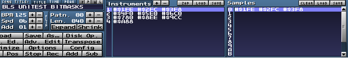

# BLITSnd - BLSconvert user manual

## Command line

The converter gives you heavy feedback on the source .MOD / .XM convertion,
instrument pre-transposition, FX use... => do not hesitate to redirect its
output into a text file for further reading. 

* If you use .MOD format, BLSconvert expects a 4 channels .MOD file and will not produce tracks for YM voices (only 4 PCM voices)

* If you use .XM format, BLSconvert expects a 8 channels .XM file. Voice 0 to 3 will be used for PCM voices, 4 to 6 for YM voices, channel 7 is ignored. In this case BLSconvert expects to have a .INI file with the same name than the .XM file containing the YM sounds definitions

You can write a batch file where you will drag & drop your MOD / XM file... 

BLSconvert also gives an estimate of the memory used by samples storage for playing.

```
    blsconvert %1 [parameters] > output.txt
    notepad++ output.txt
```

Command line parameters:

* *-test* activates autotest mode (more information in *development* section) => *should not to be set for regular use*

* *-amigapal* to use 8287.1369 hz as reference for C2 key. Default is
  Amiga NTSC freq reference with is 8363.4229 hz for C2 key.
  Fasttracker and Milkytracker use NTSC reference.

* *-v1* will convert Cxx volume effect differently :
    * odd values (from 1 to 63) will configure STe balance while even
      values (from 0 to 64) will configure sample volume
    * else (in default mode) 8xx effects are converted as STe balance, 
	  Cxx effects as sample volume effects

-----------------------------------------------------------------------------------------------

## Resulting log

Example of convertion log for the great QUICKIE.MOD :

*Data read from input module*

```
Source module size = 23328
Title = 10minutetrash

Sample name               | Length | FineTune| Volume |LoopStrt|LoopLen
1: ~quickie intro song1   | 1886   | 0       | 64     | 1758   | 128 
2: by   mekkannik/btl     | 5088   | 0       | 64     | 0      | 0 
3: call outland bbs!      | 4752   | 0       | 64     | 0      | 0 
4:   602-872-1617         | 2034   | 0       | 22     | 0      | 0 
5: i can be found there   | 0      | 0       | 0      | 0      | 0 
6: leeching daily! haha   | 4388   | 0       | 64     | 0      | 0 
7: so call it up! byez..  | 0      | 0       | 0      | 0      | 0 
8:                        | 0      | 0       | 0      | 0      | 0 
...
31:                       | 0      | 0       | 0      | 0      | 0 

Song length = 5
RestartSongLooping = 0

0: 0 1 1 2 3 0 0 0
8: 0 0 0 0 0 0 0 0
...
120: 0 0 0 0 0 0 0 0

M.K.

Nb saved patterns 4

Pattern 0

0:  G 1 1 [0 0 0] | - 0 [c 0 0] | - 0 [c 0 0] | C 3 2 [f 0 9]
1:  - 0   [0 0 0] | - 0 [0 0 0] | - 0 [0 0 0] | - 0   [f 0 6]
2:  - 0   [0 0 0] | - 0 [0 0 0] | - 0 [0 0 0] | A 3 4 [f 0 9]
3:  - 0   [0 0 0] | - 0 [0 0 0] | - 0 [0 0 0] | C 3 2 [f 0 6]
4:  G 2 1 [0 0 0] | - 0 [0 0 0] | - 0 [0 0 0] | C 3 3 [f 0 9]
5:  G 1 1 [0 0 0] | - 0 [0 0 0] | - 0 [0 0 0] | - 0   [f 0 6]
6:  - 0   [0 0 0] | - 0 [0 0 0] | - 0 [0 0 0] | A 3 4 [f 0 9]
7:  G 2 1 [0 0 0] | - 0 [0 0 0] | - 0 [0 0 0] | C 3 2 [f 0 6]
8:  A#2 1 [0 0 0] | - 0 [0 0 0] | - 0 [0 0 0] | - 0   [f 0 9]
9:  A#1 1 [0 0 0] | - 0 [0 0 0] | - 0 [0 0 0] | C 3 3 [f 0 6]
10: C 2 1 [0 0 0] | - 0 [0 0 0] | - 0 [0 0 0] | C 3 2 [f 0 9]
11: D 2 1 [0 0 0] | - 0 [0 0 0] | - 0 [0 0 0] | - 0   [f 0 6]
12: - 0   [0 0 0] | - 0 [0 0 0] | - 0 [0 0 0] | C 3 3 [f 0 9]
13: F 2 1 [0 0 0] | - 0 [0 0 0] | - 0 [0 0 0] | A 3 4 [f 0 6]
14: C 2 1 [0 0 0] | - 0 [0 0 0] | - 0 [0 0 0] | C 3 2 [f 0 9]
15: A#1 1 [0 0 0] | - 0 [0 0 0] | - 0 [0 0 0] | - 0   [f 0 6]
16: D#1 1 [0 0 0] | - 0 [0 0 0] | - 0 [0 0 0] | C 3 2 [f 0 9]
17: - 0   [0 0 0] | - 0 [0 0 0] | - 0 [0 0 0] | - 0   [f 0 6]
18: - 0   [0 0 0] | - 0 [0 0 0] | - 0 [0 0 0] | A 3 4 [f 0 9]
19: - 0   [0 0 0] | - 0 [0 0 0] | - 0 [0 0 0] | C 3 2 [f 0 6]
...
```

*List of different keys found into the module*

```
Instrument keys used...

Instr = 1 - Key D 1
Instr = 1 - Key D# 1
Instr = 1 - Key G 1
Instr = 1 - Key A# 1
Instr = 1 - Key C 2
Instr = 1 - Key D 2
Instr = 1 - Key D# 2
Instr = 1 - Key F 2
Instr = 1 - Key G 2
Instr = 1 - Key A# 2
Instr = 2 - Key C 3
Instr = 3 - Key C 3
Instr = 4 - Key A 3
Instr = 6 - Key C 2
Instr = 6 - Key D 2
Instr = 6 - Key F 2
Instr = 6 - Key G 2
Instr = 6 - Key A 2
Instr = 6 - Key A# 2
Instr = 6 - Key C 3
Instr = 6 - Key D 3
Instr = 6 - Key D# 3
Instr = 6 - Key F 3
Instr = 6 - Key F# 3
Instr = 6 - Key G 3
Instr = 6 - Key A 3
Instr = 6 - Key A# 3
```

*Pre-tranposed keys table for each instrument*

* *Instr = sample number (source sample byte length)*
* *precomputed keys : [octave/semitone (transposed sample nb bytes) > storage divider shift]*
* *keys dynamically transposed from existing precomputed keys : {octave/semitone > octave shift}*

```
Instrument precompute...

instr 1  ( 1886): [D 1/2 (10138) >0] [D# 1/3 (9569) >0] [G 1/7 (7595) >0] [A# 1/10 (6386) >0] [C 2/0 (5690) >0] {2/2 >1} {2/3 >1} [F 2/5 (4262) >0] {2/7 >1} {2/10 >1} 
instr 2  ( 5088): [C 3/0 (7675) >0] 
instr 3  ( 4752): [C 3/0 (7168) >0] 
instr 4  ( 2034): [A 3/9 (1824) >0] 
instr 6  ( 4388): [C 2/0 (6618) >-1] [D 2/2 (5896) >-1] [F 2/5 (4958) >-1] [G 2/7 (4417) >-1] [A 2/9 (7871) >0] [A# 2/10 (7429) >0] {3/0 >0} {3/2 >0} [D# 3/3 (5566) >0] {3/5 >0} [F# 3/6 (4680) >0] {3/7 >0} {3/9 >1} {3/10 >1} 
```

*Cumulated byte size for all precomputed samples of an instrument*
* *If volume effect is used, instrument uses 16 bits to store each byte of the sample, else 8 bits only
  =\> it impacts the computed byte size of the instrument*

```
instr 1  size = 43640   no volume effect found >0
instr 2  size = 7675    no volume effect found >0
instr 3  size = 7168    no volume effect found >0
instr 4  size = 1824    no volume effect found >0
instr 6  size = 94874   volume used >0 [133](0x40)  >2 [10](0x10)  
```

*Estimated total size used by samples in memory when .BLS file will be loaded*

```
total size = 155181 for 17 precomputed samples and 27 keys
```

*A heap of a size of max of these two values will be allocated for samples at init of the BLITsnd player (sizes for even addresses / odd addresses heaps)*

```
heapsize 154524 155896
```
 
-----------------------------------------------------------------------------------------------

## Data convertion from MOD / XM file

### Sample section

#### PCM sounds

*   **Sample volume**: fixed volume defined into sample section is applied
    statically at module convertion. So if you want to lower the sample
    volume at once for all keys, do it there. It has no cost in terms of
    memory footprint.
*   **Relative note** only in XM format. Transpose reference key for the sound by this number of semi tones.
*   **Sample fine tune** for -8 to +8 in semitones / 8. In MilkyTracker value goes from -128 to 128 =\> you have to step by 16 increments.
*   **Source sample length** is limited to 64k but destination transposed
    samples may exceed 64k except for instruments using arpeggio effect.
    When using arpeggio, destination transposed samples may not exceed
    64k.
*   **Sample loop length** should not exceed 16k in the transposed sample
    (more constraining than standard .MOD format). BLSconvert will output
    a warning if the size value is over this limit.
*   **Sample name** : naming convention in samples change the behaviour of
    the converter

    -   Instrument which names begins by :

        -   **\~0** will not be transposed meaning all keys for this
            instrument will use the same sample. This one should be
            sampled at 25khz which is the replay frequency. This can be
            useful for high quality drums

        -   **\~2** requires linear interpolation when pre-transposing
            corresponding sample instead of closer byte method.  
			Warning: this setting disable storage divider optimization for 
			the current sample (you should only use it if it really makes a difference
			in terms of quality) !

        -   **\~2:\<size in bytes\>** the sample will be transposed
            linearly interpolated in a way that destination sample will
            be *\<size in bytes\>* size.  
			All keys of this instrument will use the same sample. 
			This setting can be useful if you want to store
            a long looping sample that exceed 16KB =\> you cannot use
            looping sample in this case.  
			Having a fixed destination size allows to loop synchronously 
			score and sample (500 bytes are played each frame). 
			Look at test module DATA\UNITTEST\LONGLOOP.MOD/BLS as example.  
			Of course in this case tuning your sample may be complicated (time stretching ?)

        -   **\~1:\<size in bytes\>** same than \~2 but using direct
            transposition without interpolation... 
			(does not disable storage divider optimization)

    -   You can put tags \#\$XYY into instruments list names to specify
        bitmasks values (look at 0xE0X effect for more info).  
		- X is the bitmask : 1 to 0xE, 0 is reserved as no mask value =\>
        0xFFFF
		- YY the one byte sample mask value
		(Please note X and Y are hexadecimal values)

        

        If you do not customize bit masks, default values will be used by OxE0 effect :

```
        bitmask [0x0] = FFFF 
        bitmask [0x1] = FEFE 
        bitmask [0x2] = FCFC 
        bitmask [0x3] = F8F8 
        bitmask [0x4] = F0F0 
        bitmask [0x5] = E0E0 
        bitmask [0x6] = C0C0 
        bitmask [0x7] = 8080 
        bitmask [0x8] = EEEE 
        bitmask [0x9] = CCCC 
        bitmask [0xA] = 8888 
        bitmask [0xB] = 7F7F 
        bitmask [0xC] = 3F3F 
        bitmask [0xD] = 1F1F 
        bitmask [0xE] = 0F0F 
        bitmask [0xF] = 0000 
```

#### YM sounds

When using .XM format if you have a corresponding YM sounds .INI script available, YM sounds & voices are available in your module.

In this case : as soon as a sample entry has a name equal to a YM sound name defined into the script, the corresponding instrument number in patterns voices 4,5,6 will play this YM sound.

### Score patterns FX

.MOD /.XM score defines keys but also effects. These effects are only partially supported by BLITSnd.  
* Freq, volume slides... effects are not supported by BLITSnd (portamento on PCM voices in particular)
* Some effects entries are used differently by BLITSnd

Here is the list of effects that can be used :

#### Common FX (for PCM and YM voices)

-   **0xBXX** : jump to song position 0xXX : stop the pattern after this row,
    and continue the song at song position

-   **0xDXX** : pattern break : stop the pattern after this row, and
     continue the song at the next pattern at row X * 10 (0xA) + Y"

-   **0xE6X** : loop pattern : set the start of a loop to this row if
     X is 0, otherwise after this row, jump back to the start of a
     loop and play it another X times before continuing. If the start
     of the loop was not set, it will default to the start of the
     current pattern. Loop only happens into current pattern. Loops can not be nested.

-   **0xEEX** : delay pattern next row interpretation by X ticks

-   **0xFXX** : set speed : with speed = X * 16 + Y  
                if speed < 32 then each row will last speed ticks  
                else each row will last 60*50 / speed

#### PCM voices (0..3) FX

-   **0x0XY** : arpeggio for chiptune style ;) (samples using arpeggio should not 
    exceed 64KB once transposed !) : "play note, note + X semitones, note + Y semitones, then return to original note" stepping at each tick

-   **0x8XX** : balance (when not using -v1 volume convertion mode !) =\>
    panning effect is used for balance (different but gives an idea if
    you listen to only left or right channel). Also in modern mod
    trackers you have an option to ignore 0x8 FX.
    -   For voice 0 & 3, use 0x880 to 0x8FF to set left volume
    -   For voice 1 & 2, use 0x87F to 0x800 to set right volume
    -   If you use two effects 0x8 on voices of same channel on the same
        row, the last in voice order will be considered
    -   Values are rounded to sets volume at STe LMC balance resolution
        of -2db steps.  
		XX value determines 0 to 127 range for each side.
        This value is divided by 2 and goes through LMC values convertion table to obtain the equivalent STe balance channel value.


```
         | LEFT CHANNEL (voice 0 & 3)       | RIGHT CHANNEL (voice 1 & 2)      | 
         |----------------------------------|----------------------------------| 
         | 0 (<=0x80) 0db | 32 (0xC0) -6db  | 0  (0x00) -40db | 32 (0x40) -6db | 
         | 1  (0x82)  0db | 33 (0xC2) -6db  | 1  (0x02) -36db | 33 (0x42) -6db | 
         | 2  (0x84)  0db | 34 (0xC4) -6db  | 2  (0x04) -30db | 34 (0x44) -6db | 
         | 3  (0x86)  0db | 35 (0xC6) -6db  | 3  (0x06) -26db | 35 (0x46) -6db | 
         | 4  (0x88)  0db | 36 (0xC8) -8db  | 4  (0x08) -24db | 36 (0x48) -6db | 
         | 5  (0x8A)  0db | 37 (0xCA) -8db  | 5  (0x0A) -22db | 37 (0x4A) -4db | 
         | 6  (0x8C) -2db | 38 (0xCC) -8db  | 6  (0x0C) -20db | 38 (0x4C) -4db | 
         | 7  (0x8E) -2db | 39 (0xCE) -8db  | 7  (0x0E) -20db | 39 (0x4E) -4db | 
         | 8  (0x90) -2db | 40 (0xD0) -8db  | 8  (0x10) -18db | 40 (0x50) -4db | 
         | 9  (0x92) -2db | 41 (0xD2) -8db  | 9  (0x12) -18db | 41 (0x52) -4db | 
         | 10 (0x94) -2db | 42 (0xD4) -10db | 10 (0x14) -16db | 42 (0x54) -4db | 
         | 11 (0x96) -2db | 43 (0xD6) -10db | 11 (0x16) -16db | 43 (0x56) -4db | 
         | 12 (0x98) -2db | 44 (0xD8) -10db | 12 (0x18) -14db | 44 (0x58) -4db | 
         | 13 (0x9A) -2db | 45 (0xDA) -10db | 13 (0x1A) -14db | 45 (0x5A) -4db | 
         | 14 (0x9C) -2db | 46 (0xDC) -12db | 14 (0x1C) -14db | 46 (0x5C) -4db | 
         | 15 (0x9E) -2db | 47 (0xDE) -12db | 15 (0x1E) -12db | 47 (0x5E) -2db | 
         | 16 (0xA0) -2db | 48 (0xE0) -12db | 16 (0x20) -12db | 48 (0x60) -2db | 
         | 17 (0xA2) -2db | 49 (0xE2) -12db | 17 (0x22) -12db | 49 (0x62) -2db | 
         | 18 (0xA4) -4db | 50 (0xE4) -14db | 18 (0x24) -12db | 50 (0x64) -2db | 
         | 19 (0xA6) -4db | 51 (0xE6) -14db | 19 (0x26) -10db | 51 (0x66) -2db | 
         | 20 (0xA8) -4db | 52 (0xE8) -14db | 20 (0x28) -10db | 52 (0x68) -2db | 
         | 21 (0xAA) -4db | 53 (0xEA) -16db | 21 (0x2A) -10db | 53 (0x6A) -2db | 
         | 22 (0xAC) -4db | 54 (0xEC) -16db | 22 (0x2C) -10db | 54 (0x6C) -2db | 
         | 23 (0xAE) -4db | 55 (0xEE) -18db | 23 (0x2E) -8db  | 55 (0x6E) -2db | 
         | 24 (0xB0) -4db | 56 (0xF0) -18db | 24 (0x30) -8db  | 56 (0x70) -2db | 
         | 25 (0xB2) -4db | 57 (0xF2) -20db | 25 (0x32) -8db  | 57 (0x72) -2db | 
         | 26 (0xB4) -4db | 58 (0xF4) -20db | 26 (0x34) -8db  | 58 (0x74) -2db | 
         | 27 (0xB6) -4db | 59 (0xF6) -22db | 27 (0x36) -8db  | 59 (0x76) -0db | 
         | 28 (0xB8) -6db | 60 (0xF8) -24db | 28 (0x38) -8db  | 60 (0x78) -0db | 
         | 29 (0xBA) -6db | 61 (0xFA) -26db | 29 (0x3A) -6db  | 61 (0x7A) -0db | 
         | 30 (0xBC) -6db | 62 (0xFC) -30db | 30 (0x3C) -6db  | 62 (0x7C) -0db | 
         | 31 (0xBE) -6db | 63 (0xFE) -36db | 31 (0x3E) -6db  | 63 (0x7E) -0db | 
         |                | 64 (0xFF) -40db |                 | 64(>=0x7F)-0db | 
```

-   **0x9XY** : set sample offset (corresponding to source sample offset not
    transposed). Offset = X\*4096 + Y\*256.

-   **0xCXX** : volume effect. As it is far less precise, values are
    converted like this (one shift = -6 db).  
	
```
    64 (0x40) >= vol > 48 (0x30) | shift = 0   0db
    48 (0x30) >= vol > 24 (0x18) | shift = 1  -6db
    24 (0x18) >= vol > 12 (0x0C) | shift = 2  -12db
    12 (0x0C) >= vol > 6  (0x06) | shift = 3  -18db
    6  (0x06) >= vol > 3  (0x03) | shift = 4  -24db
    3  (0x03) >= vol > 1  (0x01) | shift = 5  -30db
    1  (0x01) >= vol > 0  (0x00) | shift = 6  -36db
    vol = 0                      | shift = 8   mute
```

But when using -v1 volume convertion mode, even values are used to
control bitshift like described here, but odd values control the STe
LMC balance like described for effect 0x8 in -v0 mode

```
         | 1  (0x01) -36db | 33 (0x21) -6db | 
         | 3  (0x03) -26db | 35 (0x23) -6db | 
         | 5  (0x05) -22db | 37 (0x25) -4db | 
         | 7  (0x07) -20db | 39 (0x27) -4db | 
         | 9  (0x09) -18db | 41 (0x29) -4db | 
         | 11 (0x0B) -16db | 43 (0x2B) -4db | 
         | 13 (0x0D) -14db | 45 (0x2D) -4db | 
         | 15 (0x0F) -12db | 47 (0x2F) -2db | 
         | 17 (0x11) -12db | 49 (0x31) -2db | 
         | 19 (0x13) -10db | 51 (0x33) -2db | 
         | 21 (0x15) -10db | 53 (0x35) -2db | 
         | 23 (0x17) -8db  | 55 (0x37) -2db | 
         | 25 (0x19) -8db  | 57 (0x39) -2db | 
         | 27 (0x1B) -8db  | 59 (0x3B) -0db | 
         | 29 (0x1D) -6db  | 61 (0x3D) -0db | 
         | 31 (0x1F) -6db  | 63 (0x3F) -0db | 
```

-   **0xE0X** : use specified bitmask \[0 -\> 15\].  
	On Amiga 0xE0 effect is used
    to activate / disable the Paula analog filters. This fx is often
    ignored by soundtrackers, reason why I have used it for blitter
    specific stuff.  
	But you will not be able to listen to it with a
    standard soundtracker =\> you will have to test with BLSplay to
    render it

-   **0xE9X** : retrigger sample every X ticks (0 do not retrigger)

-   **0xEDX** : delay sample by X ticks

Note that BLS specific effects (STE balance and bitmask set) are not reset when a new key is entered => the last value is kept to allow cumulating with other standard effects. So you need to be carefully end these effects where appropriate.

If you use XM format, you can use volume column => it will manage the sound like 0xCxx effect using bit shift 

#### YM voices (4..6) FX

-   **0x1XX** : slide freq up : XX is the number of semi tones on which you want to apply your pitch bend effect. It will use the timing previously set with 3XX

-   **0x2XX** : slide freq down : XX is the number of semi tones on which you want to apply your pitch bend effect. It will use the timing previously set with 3XX

-   **0x3XX** : set pitchbend ticks value for YM player : XX is the number of frames (20ms ticks) to interpolate from one note to a new note

-   **0x5XX** : set portamento ticks value for YM player : XX is the number of frames (20ms ticks) to interpolate from one note to a new note

-   **0x9XX** : set fine freq command (absolute value that will be added to ym freq register). XX is a signed value : 0->7F (0 to 127) / FF->80 (-1 to 128)

-   **0xC0X** : set volume value for YM player : X is the volume between 0 and F. It is combined (multiply) with the volume sequence defined into the YM sound. If X = F (default value when no 0xC fx applied) the YM sound volume is applied as is, else it lowers the values defined into the sound accordingly

If you use XM format, you can use volume column => it will manage the sound like 0xC0x effect

-----------------------------------------------------------------------------------------------

## BLitZ mode specificities

BLitZ mode is the only mode managed by the STe ASM implementation.

* This optimized mode works using delta compressing of 
    - low level command variables for PCM voices
    - YM2149 registers values for YM voices
* BLSconvert re-use delta compressed data of the same pattern when used at different song track indexes to minimize memory use
* This can end up producing some glitches when the same pattern does not start with the same PCM / YM state (coming from previous patterns into the song track)
* Since version 2.3.0, BLSconvert should output warnings if these kind of configurations are detected (maybe they do not produce glitches you can hear, but you need to check...)
* You can fix these problems two ways :
    - if possible you can unify the ending state of the different previous patterns to be in identical state when beginning the pattern (for instance: by disabling a YM voice on last row of previous pattern...)
    - when not possible, you can duplicate the corresponding pattern and use these different instances of the same pattern into the song track to avoid start divergence on the use of the pattern

-----------------------------------------------------------------------------------------------

## Client events track

BLSconvert allows to optionnally convert and timecode (in frames number) a client events script relatively to the soundtrack. 

Note: the sequence is coded relatively to the trackindex (not the patternindex) to allow encoding different events all along the song even when patterns are re-used.

### Basic syntax

Syntax for script is :

```
; Comment

t trackindexnumber

row commandnum [commandnum] ...
```

Example:

```
; Sequence test

; t Trackindex
; Row | Commands...

t 00

00 1 20 30
40 10

t 01

00 2 44 23
04 44
```

### Macros
In order to ease the use of commands, you can define common values throught macros definition :

```
$ MacroName Value
```

Example: 

```
$ LAYfxLayerz               14

$ LAYvoice1_1               20
$ LAYvoice1_2               21
$ LAYvoice1_4               22
$ LAYvoice1_3               23

$ LAYvoice1_ym1             24
$ LAYvoice1_ym2             25
$ LAYvoice1_ym3             26

$ LAYnoInterlace            28
$ LAYinterlace14_23         29
$ LAYinterlace13_21_42_34   2A
$ LAYinterlace12_24_43_31   2B

$ LAYvoice2_1               30
$ LAYvoice2_2               31
$ LAYvoice2_4               32
$ LAYvoice2_3               33

$ LAYvoice2_ym1             34
$ LAYvoice2_ym2             35
$ LAYvoice2_ym3             36

$ LAYcurveTwins             40
$ LAYcurveSolo              41
$ LAYcurveSiamese           42
$ LAYcurveKeys              43
$ LAYcurveRawSamples        44

$ LAYcurveSoloFillAll       45
$ LAYcurveSoloFill1         46
$ LAYcurveSoloFill2         47
$ LAYcurveSoloFill3         48
$ LAYcurveSoloNoFill        49

$ LAYflash                  4A

; t Trackindex
; Row | Commands...

t 00

00 LAYfxLayerz LAYcurveSiamese LAYnoInterlace LAYvoice1_ym1 LAYvoice2_ym1
40 LAYcurveSolo LAYnoInterlace LAYflash LAYvoice1_1
```

### Include

In order to share macros definitions between a set of scripts you can include definitions from a separate file

```
#includedfilename.txt
```

Example: 

```
#FXMACROS.TXT

; Sequence test

; t Trackindex
; Row | Commands...

t 00

00 LAYfxLayerz LAYcurveSiamese LAYnoInterlace LAYvoice1_ym1 LAYvoice2_ym1
40 LAYcurveSolo LAYnoInterlace LAYflash LAYvoice1_1
```

with FXMACROS.TXT containing

```
$ LAYfxLayerz               14

$ LAYvoice1_1               20
$ LAYvoice1_2               21
$ LAYvoice1_4               22
$ LAYvoice1_3               23

$ LAYvoice1_ym1             24
$ LAYvoice1_ym2             25
$ LAYvoice1_ym3             26

$ LAYnoInterlace            28
$ LAYinterlace14_23         29
$ LAYinterlace13_21_42_34   2A
$ LAYinterlace12_24_43_31   2B

$ LAYvoice2_1               30
$ LAYvoice2_2               31
$ LAYvoice2_4               32
$ LAYvoice2_3               33

$ LAYvoice2_ym1             34
$ LAYvoice2_ym2             35
$ LAYvoice2_ym3             36

$ LAYcurveTwins             40
$ LAYcurveSolo              41
$ LAYcurveSiamese           42
$ LAYcurveKeys              43
$ LAYcurveRawSamples        44

$ LAYcurveSoloFillAll       45
$ LAYcurveSoloFill1         46
$ LAYcurveSoloFill2         47
$ LAYcurveSoloFill3         48
$ LAYcurveSoloNoFill        49

$ LAYflash                  4A
```
