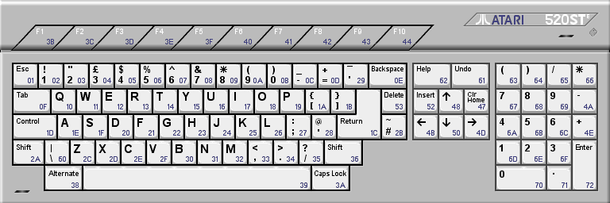
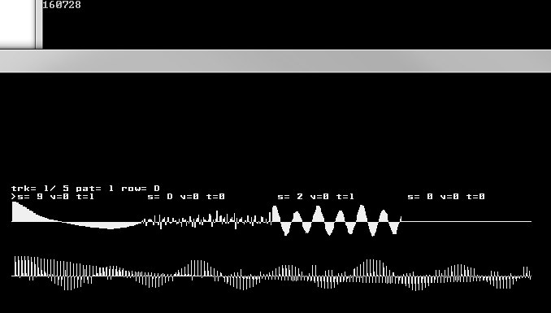
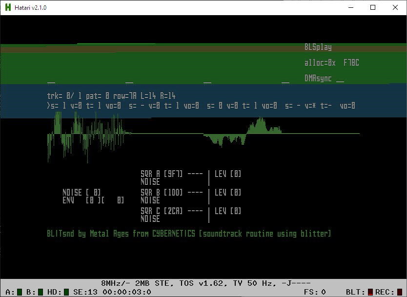

# BLITSnd - BLSplay user manual

The program displays the 4 voices samples (and also the multiplexed
buffer on PC) while playing. Some keys allows you to modify the replay :



* **ESC** quits player
* **BACKSPACE** 
	* on ST: toggles sync to first display line / sync to VBL start (strangely there is less clicks when running out of display area at VBL start on STe)
	* on PC: toggles resync when displaying YM emulation curves
* **1-4** (! not the numpad) select a voice to modify
* **5-8** (! not the numpad) mute / unmute a voice
* **SPACE** mutes / unmutes selected voice
* **Q W E R T Y U I O P A S D F G H** apply a mask effect on the selected voice
    ```
	Q   bitmask [0x0] | off       FFFF 
	W   bitmask [0x1] | default = FEFE 
	E   bitmask [0x2] | default = FCFC 
	R   bitmask [0x3] | default = F8F8 
	T   bitmask [0x4] | default = F0F0 
	Y   bitmask [0x5] | default = E0E0 
	U   bitmask [0x6] | default = C0C0 
	I   bitmask [0x7] | default = 8080 
	O   bitmask [0x8] | default = EEEE 
	P   bitmask [0x9] | default = CCCC 
	A   bitmask [0xA] | default = 8888 
	S   bitmask [0xB] | default = 7F7F 
	D   bitmask [0xC] | default = 3F3F 
	F   bitmask [0xD] | default = 1F1F 
	G   bitmask [0xE] | default = 0F0F 
	H   bitmask [0xF] | default = 0000 
    ```

* **RETURN** resets max raster time on ST
* **NUMPAD 1-2-4-5-6-7-8-9** increase bitshift volume if current instrument supports volume.  
  Support for this option is disabled by default into the Atari ST ASM routine.
* **NUMPAD 0** reset currently running STe balance and bitmaks effects on all channels
* **CURSOR LEFT-CURSOR RIGHT** decrement / increment song track index
* **CURSOR UP** return to beginning of current pattern
* **F1-F10** set song track index to 0..9
* **NUMPAD -** change current interface panel

In the console output, the player displays the whole memory allocated by the player in bytes.

The routine is :

* a bit faster when voice(s) has no instrument active (blitter fills corresponding bytes with 0)
* a lot faster if a whole word channel combination (word 0 : 0 + 1 or word 1 : 2 + 3) is unused 
  (it can be useful to play with this when you are in a critical performance part of your application).  
  The modified version _QUICKIE.MOD (inverted channels) demonstrates this...

BLITSnd uses up to 16% of a 50hz VBL on a 8mhz STe approximately. 
 
When BLITsnd synchronizes DMA sound correctly, the hyphen position after "DMA sync" changes regularly (it works correctly on my STe and with Hatari 2.1.0 but it does not work with Steem 3.2 debug where the replay routine gets out of sync with DMA loop after a while)





*Max raster time reached in blue / current raster time in green*
