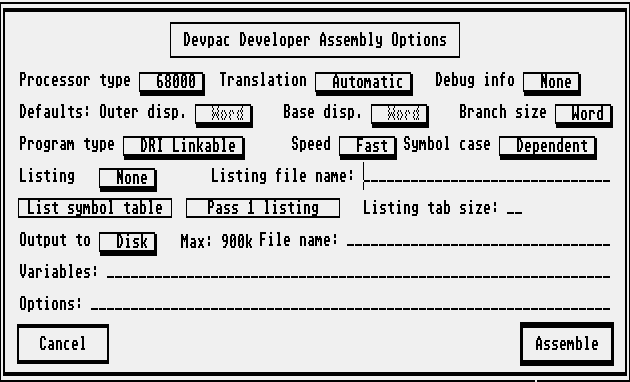
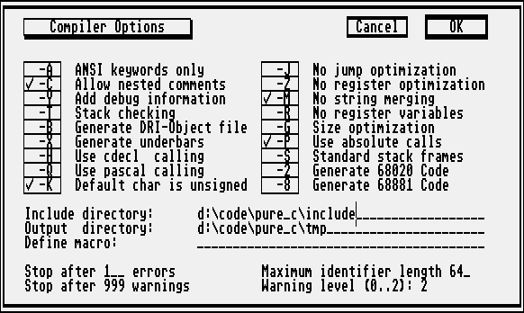
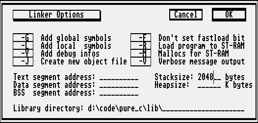

# BLITSnd - Development

## Build on PC
BLITSnd executables have been developed in Visual Studio Express 2010. Solution is available here *PC\DemOS.sln*.  
BLSconvert and BLSplay should compile directly on PC.  
For BLSplay, you will need *dsound.lib* and *dxguid.lib* => maybe you will have to setup *"Additional library include directories"* differently in the linker options.

## Build on ST
BLSplay has been compiled using Pure C and Devpac.

### ASM
Unfortunately with Devpac, I have not been able to use relative path in the *output* option.
So you will probably have to customize the .S file in order to assemble them.
```
	output	D:\PROJECTS\DEMOS\OUTPUT\BLITSNDP.O
```
... or it can be simpler to use the same path than me on the ST for the root of the project (D:\PROJECTS\DEMOS)

Look at .PRJ file to find the list of .S file you need to assemble. Currently it is :

```
OUTPUT\BLSZPLAY.O
OUTPUT\BLSZIO.O
OUTPUT\BPLAYER.O
OUTPUT\LOAD.O
OUTPUT\RASTERS.O
OUTPUT\STANDARD.O
OUTPUT\SYSTEM.O
OUTPUT\TRACE.O
```

Options I have used to assemble in devpac :



### C

In Pure C you should use the BLSPLAYB.PRJ file.  
The options I use in Pure C are :





## The code

### C / ASM

In order to make development easier I have maintained equivalent ASM / C routines for the player.
* On PC we always use C version
* On ST we can use C or ASM versions or a mix of ASM and C routines
	- blsUSEASM macro defined in DEMOSDK\BLITSND.H allows to switch between full ASM / full C replay routine
	- in order to use a mix of C and ASM routines, you need to :
		- defines blsUSEASM to 1
		- undefine (comment) BLSupdate macro
		- set exportall to 1 in DEMOSDK\BLITSNDP.S
		- then you can choose which version to use by commenting / uncommenting macros at the beginning of DEMOSDK\BLITSNDP.C 
		(*blsUpdateAllVoices, blsUpdateSoundBuffers, blsUpdateScore, blsUpdateRunningEffects*)
* Currently the replay routines *blsUpdate* and *blsAsyncUpdate* are available in ASM => there is not problem to use them in interrupts...
* The player inits (DEMOSDK\BLITSND.C) are in C. It would be a good idea to port *BLSinitSample* function to speed up the process though.
	
### Autotests

BLITSnd is provided with a set of test modules in BLSPLAY\DATA and BLSPLAY\DATA\UNITTEST

The BLSplay *-test* mode is very useful to develop. In this mode, instead of an audio replay, the player will dump :
* a 4 voices RAW sample file of the replay. You can import them in Audacity for example (import => raw data => 4 channels / 8 bits signed PCM / 25khz).
	- dumps are saved into _logs\ASM or _logs\C or _logs\PC folder according to the running version
* a text file that contains player routine variables states for each frame
* a file dump of pre-transposed samples storage

Batch files are provided (they expect to have notepad++ and winmerge installed)
* PC\BlsConvert.bat converts all the test .MOD file and visualize convertion results in notepad++
* PC\BlsAutotest.bat compute resulting files using BLSplay test mode on all test modules, then compare results to reference results stored in BLSPLAY\DATA\AUTOTEST\PC using winmerge 
* PC\BlsComparePC_ST.bat compare last generated results into _logs\PC with _logs\C (Atari ST C version) and _logs\ASM (Atari ST ASM version) using winmerge

So when doing a code change that should not affect the result (like an optimization) it is quite easy to check for regressions using these batches / test mode...
