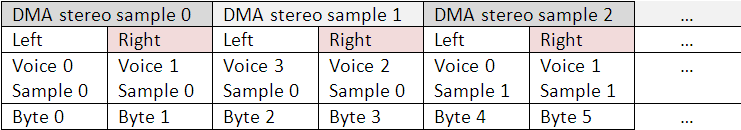
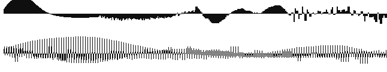
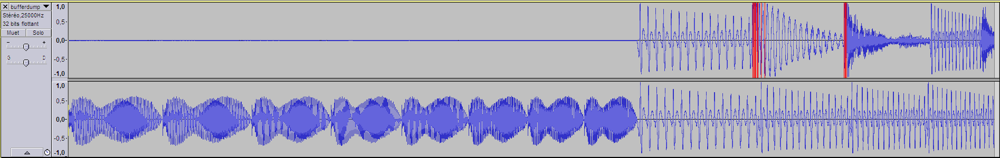

# BLITSnd - PCM mixing

## .MOD is 4 voices

I do not have the time to develop an edition tool from scratch, so the simplest way is to rely on existing .MOD/.XM formats and develop a converter. It also gives the opportunity to do all precomputation.

For .MOD format, we need 4 voices (not only 2 voices like provided in
the initial blitter sound proptotype). The blitter cannot add samples, but it is good at interleaving : a good solution is to use multiplexing technique like Protracker 2 did on STe in the 90's =\> interleaves 2 replays at 25 khz with DMA sound running at 50khz stereo. This technique also preserves the 8 bits dynamic of samples.


  


*The 4 voices (at the top) mixed into one stereo 50khz buffer (below)*  

## Blitter constraints and opportunities

*   Mixing sound with the blitter allows achieving a rather fast replay
    routine: around 16% of a 50hz VBL approximately for 4 voices
    25khz replay multiplexed on 50khz DMA
*   Blitter cannot freely transpose samples (except for trivial integral cases) => we need to pre-transpose samples for most semi-tones used into
    the score
*   Unfortunately the samples pre-transpose technique has a big memory
    footprint and also has strong constraints like forbidding portamento
    effects

On the other side, what the blitter does well for free :

*   Interlacing samples into DMA buffer. It will use blitter endmasks
    for the 2nd pass (it is not free though as it costs 4 cycles per
    word when != 0xFFFF)
*   Looping : you can use small looping waves to limit pre-transpose
    memory cost on melodic lines. Sample looping will combine use of X
    and Y sizes in the blitter operation.   
	Constraint coming from this : pre-transposed sample loop size should 
	not exceed -16384 bytes because SOURCE \_Y\_INCREMENT blitter register 
	is a 16 bits signed register and sample bytes storage is interleaved (-32768 / 2).
*   Samples duplication: when X size is not used for looping samples,
    you can use it to duplicate samples.  
	As the replay frequency is quite high compared to sample frequencies stored in .MOD, this is an opportunity to save memory.
*   Octave transpose : blitter can do octave transpose dynamically
    instead of pre-transposing samples by taking 1 sample on 2 (more
    info in *sample memory storage* chapter).  
	This will mainly use SOURCE\_X\_INCREMENT register
*   Bit-shifting : it provides a rough volume control by -6 db steps.
    This volume control is too steep to provide fine volume slide, but
    it is enough to create echoes effects for example.  
	Problem : blitter bitshift is not signed so we will have to emulate this (more info in *sample memory storage* chapter)
*   Additional FX : you can mask your samples dynamically with a pattern mask.  
	For example : it is easy to decimate bits to make your samples sounding saturated / metallic. From my experience it works quite well with bass lines as it adds high frequency harmonics on a sample which have none.  
	This will use blitter halftone registers.
	
    *Masking value & resulting wave*
    
    ``` 
    no mask 
    ``` 
     
                           
    ``` 
    0xF0 
    ``` 
       
                           
    ``` 
    0xC0     
    ``` 
       
                           
    ``` 
    0x80    
    ``` 
       
                           
    ``` 
    0xEE     
    ``` 
       
                          
    ``` 
    0xCC     
    ``` 
       
                           
    ``` 
    0x7F     
    ``` 
       
                           
    ``` 
    0x3F     
    ``` 
           
    *The same bass line wave modified by different masking patterns...*

	
## Blitter and samples memory storage

### Interleaving, bitshift, volume effects...

Blitter works with 16 bits words, not bytes. Fortunately STe DMA sound used in stereo mode interlaces 8 bits samples left / right =\> by using endmasks correctly, blitter can copy 8 bits samples on a word basis.

It means we will have to store our samples in memory on a one byte
per word basis :

* in the best case we can interleave instruments storage to optimize memory footprint (by 2) : in this case BLITsnd achieves a one byte per sample storage in memory
* when volume effect (using bitshift) are used for a specific instrument, samples cannot be interleaved : blitter bit shift is unsigned but we need to emulate right signed bit shift for our samples. A way to emulate signed bit shift is to precompute the upper byte as 0 or -1 according to the sign of the sample byte.

Samples storage in memory looks like this :



In this example (QUICKIE.MOD) :

* First instrument uses volume effects. It is stored at the beginning of the buffer (on the left). In each 16 bits word : the higher byte is 0 or -1 and the lower bytes contains the sample => it uses 2 bytes in memory per pre-transpose sample byte
* On the remaining space of the buffer (on the right) instruments do not use volume effect. Their storage is interleaved. Here it uses 1  byte per pre-tranposed sample byte

### Frequency transposition

Each sample needs to be transposed to be played at 25khz on the STe
which is a quite high rate for memory usage. On Amiga, Paula has a variable replay rate for each voice (transposing samples in real time). When playing a C2 keys its sample frequency on Amiga is
8287.1369 hz in Pal mode, 8363.4229 in NTSC mode.

For example, if you want to pre-transpose a C2 key for a 25khz it means that your sample will be more than 3x larger when pre-transposed.

In order to save memory, I use two opportunities offered by the blitter :

*   As said, we can do easily octave transpose. It will save some
    pre-transposed required combinations by only pre-transposing the
    sample for the lower keys. Then if keys 12, 24, 36... semi-tones
    higher are used, they are based on the same sample and transpose it in real time by copying 1/2 or 1/4 or 1/8... bytes. It will
    also be possible to transpose by 19 semi tones higher taking 1/3
    bytes (quite a good approximation of 2.996614 theorical value) but this is not currently implemented (look at [possible future
    improvements](BLITSnd_backlog.md))

*   When instrument does not loop, we can combine the use of blitter X
    and Y size registers differently : it is possible to use them to
    repeat the same sample byte multiple times to save memory of
    pre-tranposed sample. For example for a B1 key, instead of storing a
    25khz sample meaning multiply the number of samples by 3.167 (25 khz
    / 7894.02 khz), we can store a sample pre-tranposed by 1.05565 ratio
    and duplicate dynamically by 3 number of bytes with the blitter. To
    avoid collision with octave transpose, BLITsnd currently only allows
    power of 2 ratios : x2, x4, x8... (look at [possible future
    improvements](BLITSnd_backlog.md) for more considerations about this). For the case of B1 key it means we will store a sample pre-transposed by 1.5834
    ratio and duplicate by 2 number of bytes with the blitter. BLITSnd
    allows you to choose direct or linear interpolation when
    pre-transposing samples. Please note: when linear interpolation is
    selected, this storage optimization is disabled !

## Test case

As a test case I have used a good small Amiga module from the 90's named
"QUICKIE.MOD". Amiga .MOD version is 23kb. When loaded in memory
the BLS format will take around 164kb. Before the different memory
optimizations, the first version of the routine was using around
290kb to play the same module...
