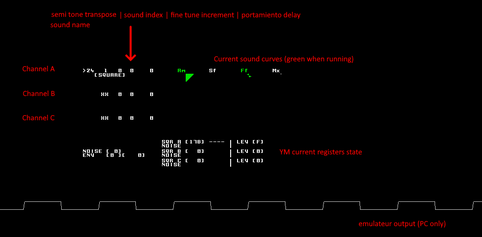

# BLITSnd - SynthYM

BLITSnd system now also includes a YM soundchip system.
The YM sounds can be configured with a set of sounds described into an ascii script.

## Script format

### Overview
This script is defined this way...


```
    ;----------------------------------------------------------------------
    ; SYNTH YM SOUNDS
    ; Commented lines begin by ';' sign on the first character of the line
    ; ---------------------------------------------------------------------
```

_for each sound :_

```
        [Soundname]

        CURVETYPE
        ratevalue
        curvevalues...
        <

        CURVETYPE
        ratevalue
        curvevalues...
        <

        END
```

### Sound

For each sound, you have a section describing the sound...

* The sound name max length is 23 chars. I have choosen to edit sounds script using an advanced text editor (like notepad++ for instance) as an .INI file, then define sounds name between brackets [] => it allows to roll / unroll each sound section into the editor...
    
* Then you find a set of curves (small sequences) controlling various parameters of the sound : a sound is a set of curves interpreted each x frames. The max tick frequence for these curves is 50hz (20ms period) => a curve is always interpretated on a multiple of 20ms

### Curves

* Each curve begins with a number that determines the interpretation frequence of the curve in number of frames (x 20ms) => 1 is the fastest possible rate 

* Each curve can have an attack / sustain / release phases
    * attack plays once
    * sustain plays in loop till the key is pressed
    * then release plays once
    * when a curve end is reached this curve interpretation is stopped (but other curves of the current sound may go on running...)
    * each phase is optional

```
               ____________   _   _   _   _   _   _   _   ________
             _/            \_/ \_/ \_/ \_/ \_/ \_/ \_/ \_/        \_
           _/                                                       \_
          /                                                           \_
         /                                                              \_
        /                                                                 \_
        -----------------> <-------------------------------> ---------------->
        Attack plays once       Sustain plays in loop        Release plays once
                               till key remains pressed
```

* A curve is a list of values that will modify a specific aspect in the YM registers state. The curve can be edited as you prefer following two methods :

    * ascii art style curve :  
    A attack  
    S sustain  
    R release  
    The number of letter(s) determine the level (one char for 1 unit)  
    xx or |xx are positive values  
    xx| is negative value  
    | is zero  

        _Here are some examples :_

```
        AMP
        8
        SSSSSSSSSSSSSSS
        RRRRRRRRRRRRRRR
        RRRRRRRRRRRRRR
        RRRRRRRRRRRRR
        RRRRRRRRRRRR
        RRRRRRRRRRR
        RRRRRRRRRR
        RRRRRRRRR
        RRRRRRRR
        RRRRRRR
        RRRRRR
        RRRRR
        RRRR
        RRR
        RR
        R
        <
```

or

```
        FREQ
        2
             |
             |SSSSS
             |SSSS
         SSSS|
        SSSSS|
        <
```

or

```
        AMP
        2
        AAAAAAAA
        AAAAAAAAAAAAAAA
        SSSSSSSSSSSSSSS
        SSSSSSSSSSSSS
        RRRRRRRRRRRRRRR
        RRRRRRRRRRRRRR
        |
        |
        RRRRRRRRRRRR
        RRRRRRRRRRR
        |
        |
        RRRRRRRRR
        RRRRRRRR
        |
        |
        RRRRRR
        RRRRR
        |
        |
        RRR
        RR
        R
        <
```

* list of curve values :  
    ax attack   
    sx sustain  
    rx release  
    ... x being a positive or negative integer value
        
     _Here are some examples :_

    
```
        AMP
        1
        s15
        <
```

or

```
        FREQ
        1
        a0
        <
```

or
     
```
        FREQFINE
        2
        s0
        s-2
        s-4
        s-2
        s0
        s2
        s4
        s2
        <
```


* The list of values for current curve should end with '<' telling to go to next curve definition
    
* Here is the available curve types :
    * __MIX__ [0:3] : set the mixer register state. You can do an hybrid sound by modifying this register in time. But most of the time you set this value once when the sound starts.
        * 0 = constant max level (can be useful in a buzzer sound when cut by the enveloppe shape to get an audio signal)
        * 1 = square wave
        * 2 = noise generator signal
        * 3 = square wave + noise generator signal
    * __AMP__ [0;16] : set the current channel volume level. Volume can vary between 0 to 15. If you set 16 it tells the YM to get the volume from the enveloppe generator instead.
    * __FREQ__ [-64;64] : offset frequence of the square wave around the requested key. This value is defined in number of semi tone(s). This curve is the one to use in particular to define chiptune style arpeggio sounds. As you are not constrainted on 2 or 3 values, you can make more complex arpeggio like the ones you find in [Tim Follin](https://youtu.be/GC1dTzyb5Gs) tunes for instance.
    * __FREQFINE__ [-128;128] : fine freq offset for the square wave. This value is directly added to the current YM frequency register value => the amplitude of the added value is not relative to the selected key. It always acts at the minimum frequency resolution of the YM. This allows to make vibrato effects for example.
    * __SQRSYNC__ [0;1] : force the square wave to restart when value = 1. You cannot determine if the square will restart on up or down front (random behaviour). This can be used to resync enveloppe and square together for example when a buzzer sound starts in order to have a deterministic result (but it can also be used for other fx...)
    * __ENVSHAPE__ [0;15] : set the YM volume enveloppe generator shape (cyclic enveloppes are 8 & 12 for sawtooth, 10 & 14 for triangle)
    * __ENVFREQ__ [-64;64] : similar to FREQ curve but for the enveloppe frequence. This impacts the sound of your buzzers sounds
    * __ENVFREQFINE__ [-128;128] : like the __FREQFINE__ curve but applied on enveloppe frequency register
    * __NOISEFREQ__ [0;31] : set the frequency of the noise generator. As you have only 32 levels of possible noise frequency, the resolution is really low. Also noise freq has not been tied to the current key at the opposite of square or enveloppe frequencies. 
    * __END__ : tells this was the last curve for the current sound => go to another sound definition

*  __AMP__ curve is special compared to other curves : it determines the life time of the sound. 
    * __AMP__ curve will go till release if exists or stop when the key is not pressed anymore. When reached, current sound is stopped.
    * For all other types of curves : if there is no release but a sustain phasis, they will loop on the sustain phasis till the sound reaches the end (based on __AMP__ curve life cycle)

* Each curve affects some specific register from the YM. There is no default assignment when playing a sound into the YM registers. It implies that you need to define everything into the curves to set a parameter. 
    * For instance, if you do not define a __FREQ__ curve, you are not able to set the frequency corresponding to your key. If the __FREQ__ only have an attack but no sustain, the freq will be assigned once => the finefreq setting into SynthYM program will have no effect if you change it while playing this sound...
    * At the opposite not assigning anything by default can allow some specific effects when creating sounds using multiple channels for example. Also when testing your sound you can allow to affect finefreq specifically on square or enveloppe or both to explore different possible combinations...

## SynthYM test program

SynthYM program allows to test your scripted sound on PC or STe.



The program allows multitimbral play that allows you to conceive multiple channels sounds effects. This may be relevant in the context of BLITSnd where you have 4 PCM in parallel with your YM channels (I have the feeling, this approach has not been explored a lot...)

For an azerty keyboard on PC :

 - __TAB__ then octave __A__ to __$__ (13 keys on line 0 & 1) : play note
 - __F1__ -> __F10__ : change octave transpose
 - __LEFT__/__RIGHT__ : +/- semi tone transpose
 - __4__/__6__ (numpad) : fine tune
 - __+__/__-__ (numpad) : select sound
 - __1__/__3__ (numpad) : inc / dec score volume (0xF by default => the YM sound volume is applied as is, else it lowers the values defined into the sound)
 - __7__/__9__ (numpad) : inc / dec portamiento (operate when != 0, value is number of vbls to slide)
 - __Q__ -> __M__ / __W__ -> __";"__  : apply pitch bend on x semitones, x depending on the key. It will not do anything if portaminento or pitchbend slide already runnning. Portamiento currently selected pace is used as pace for pitchbend. Q -> M for positive pitch / W -> ; for negative pitch.
 - __UP__/__DOWN__ : select channel
 - __SPACE__ : activate / deactivate channel
 - __BACKSPACE__ (PC only) : toggle YM PC emulator curve sync display (turn off if your PC is slow)
 - __RETURN__ (PC only) : hot reloads the sound script
 - __²__ (PC only) : change sound emulator (default is the most accurate)

Curves name abreviation :

* __MIX__ : Mx
* __AMP__ : Am
* __FREQ__ : Sf
* __FREQFINE__ : Ff
* __ENVFREQ__: Ef
* __ENVFREQFINE__: Fe
* __ENVSHAPE__ : Es
* __NOISEFREQ__ : Nf
* __SQUARESYNC__ : Sy