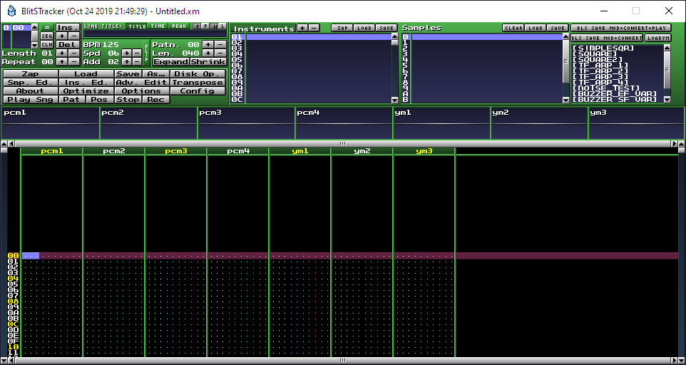

# BLITSnd - BlitsTracker

BlitsTracker is a (uggly) hacky fork of the great [Milkytracker](https://milkytracker.titandemo.org/)

* In this version an YM2149 emulator has been added
* It allows you to edit 4 voices PCM + 3 voices YM
* It loads SYNTHYM.INI script containing your YM sounds library (you can force to reload)
* It approxymately emulates the BLITsnd rendering on PCM voices (bitmasking, volume by bitshift...). BPM is fixed at 20ms multiple (planned for 50hz VBL)
* It allows you to launch BLSconvert and BLSplay directly from the tracker
* To export a PCM + YM song, save your module in .XM format. BlitsTracker will also save a copy of your SYNTHYM.INI beside your .XM file

