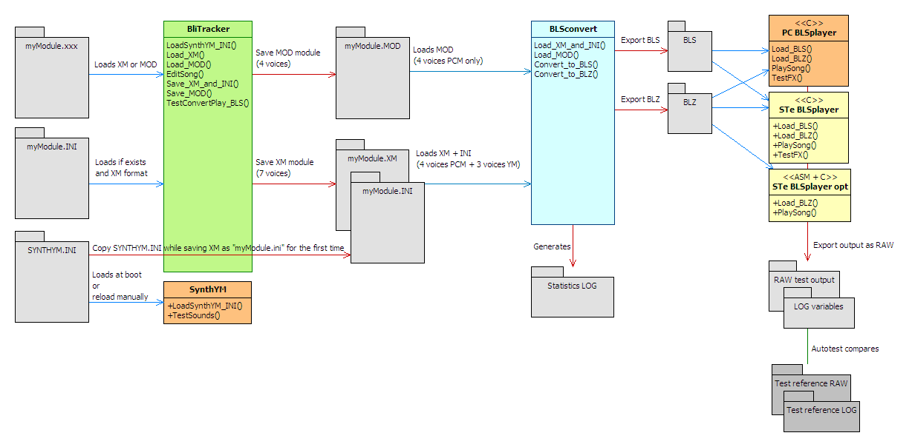

# BLITSnd - Workflow

## Changes on BLITSnd v2

The first published version of BLITSnd was designed to use .BLS format as final format. Both .C/.ASM versions of the routine were able to interpret the same score. 

On v2 new features needed to be added in score management making it lot more complex :
*   variables length patterns like in XM
*   manage volume line in XM in parallel with FX commands (need to manage potentially several command per row / columns)
*   add support from YM routine with quite complex sound management
*   7 voices (4 PCM + 3 YM)

In order to :
*   be efficient in terms of CPU
*   make .ASM version maintenance easier

Strategy of score encoding has drastically evolved :
*   .BLS format has evolved to support all these new features but it is not supported in ASM anymore (removed from code). BLS is only supported in C on PC and STe
*   a new optimized .BLZ format has been developped. BLZ is a direct recording of BLSplayer low level variables states in a delta format: it means we need BLSplayer running the whole soundtrack to produce the BLZ file. This approach is used for PCM and YM (YM registers states are delta recorded like often done in YM routines). 
*   BLZ is far easier to maintain in ASM than BLS because it is more stable when changes are done in score management
*   BLZ is supported in C on both PC and STe and also in ASM on STe
*   BLSconvert executable now includes BLSplayer logic. Only this PC executable is able to produce BLZ file

## Binaries

Currently BLITSnd provides 5 programs :

*   SynthYM : a YM play tool that allows you to design your YM sounds. You write your YM sounds library into a SYNTHYM.INI script file. SynthYM (re)loads it, and you are able to test your sounds. SynthYM is compiled for PC and ST
*   BLITracker : a hacky fork of Milkytracker designed to work with BLS system. It allows you to edit your module on PC using PCM and YM voices,bitmasking effects... You can also launch blsconvert + blsplay directly from the tracker.
Else you can edit your .MOD / .XM file using a regular soundtracker following a set of constraints and check how it converts through BLSconvert and renders with BLSplay from time to time (you will not be able to ear a lot of things like bitmasking, YM voices... directly into the tracker)
*   BLSconvert : this program will load a standard Protracker .MOD file or .XM file, analyze and convert it into .BLS format that can be played by BLITSnd replay routine. This program is a console C++ program and is currently compiled for PC-win32.
*   BLSplay : BLITSnd player loads a .BLS file or .BLZ file and plays it. This program is compiled for PC-win32 and STe
*   BLZplay : BLITSnd player loads a .BLZ file and plays it. This program is compiled for PC-win32 and STe
	
=> Binary versions of SynthYM, BLSplay, BLZplay are available for PC and Atari STe while BLITracker and BLSconvert are only available on PC.

**!!! these programs are delivered without any warranty (virus...), for your safety it is better to recompile them on your own... !!!**

## Overview

* Edit the YM sounds into SYNTHYM.INI file using a text editor (like [Notepad++](https://notepad-plus-plus.org/) for instance). You can reload the YM sounds at any time on PC
* Use BliTracker to edit your song (PCM voice 0->3, YM voice 4->6). You can reload YM sounds from SYNTHYM.INI script
* Export XM + INI files by saving XM module from BliTracker
* You can run the full chain directly from BliTracker using the "BLS convert & Play" or "BLZ convert & Play" buttons
* It is possible to test the STe version into Hatari emulator or real hardware in order to check sound renders the same way
* You can diff SYNTHYM.INI and the .INI exported with a specific module using a standard text diff tool (like [Winmerge](https://winmerge.org/) for instance)

