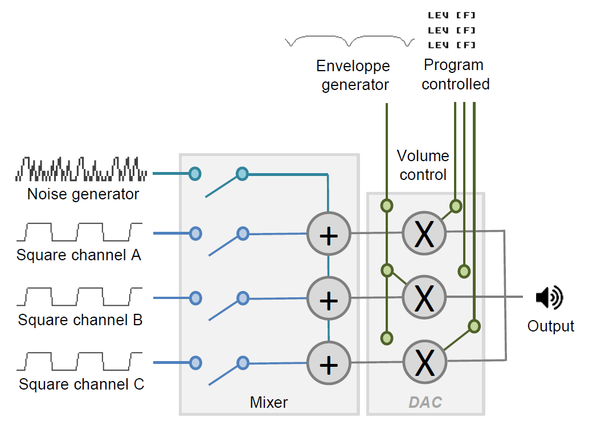
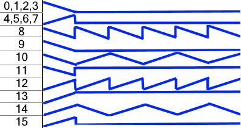
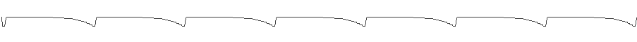

# BLITSnd

As said, BLITsnd PCM mixing is very constraining. In particular it forbids from using portamento effects. On the other side, STe also have an YM 2149 sound chip inherited from the STf. Being able to use the YM in the same time allows to have up to 3 soundchip style voices that supports portamento. YM also produces very simple / pure sounds constrasting with PCM voices.

## YM 2149 overview

You can have a look at the [great tutorials by GWEM](https://youtu.be/ErH6jXfkkfc) in particular parts 2 & 3 (timer effects does not apply in BLITSnd context).

YM 2149 looks like this. 

* It has 3 analog outputs channels. As source signal, you have :
    * 3 square wave generators
    * 1 noise generator

* You have a mixer that tells for each channel A, B or C to use :
    * square
    * noise
    * square + noise 
    * nothing (=> in this case signal is constant with a 1 value which can be used in a certain way as we will see)

At the DAC level you have a volume control for each channel. Level can be set : 

* by program (value 0 -> 15, log response) 
* or controlled by the YM envelop generator (16)

Envelop generator has been designed to make ramping volume sounds (square wave based), reason why most of the 16 proposed enveloppe shapes are not cycling. 

Envelop generator can be used in a circuitous way as an audio signal generator (instead of volume control) by choosing one of the looping shapes. Then you have to setup the envelop generator to the higher frequencies in the range it can manage : in this case the envelop signal enters the audio spectrum. This way of using the YM is named the 'buzzer' effect.

* it allows to have triangle or sawtooth effects from YM (YM is originally supposed to only produce square waves)
* when using a buzzer effect you cannot set the volume anymore : this is a consequence of the fact it has been originally designed for volume control (it is not possible to fade a buzzer for instance). This can be a problem when playing in the same time with PCM voices, as the YM plays really loud (see below *YM / DMA mixing*)
* there is only one enveloppe generator on the YM : if two sounds use the buzzer in the same time they will share the same enveloppe with the same settings
* buzzer can only play low frequency (bass) sounds. In the higher ranges of the enveloppe frequency register, the resolution is so low that you do not have access to all keys and they are noticeably detuned (try to play 5th octave with buzzer to figure out what it does...)
* triangle shape frequency is half of a sawtooth shape for the same ym setting
* buzzer can be combined with :
    * a constant signal (mixer to 0) : it will produce a pure triangle / sawtooth sound
    * square wave. The sligh detuning between square wave and enveloppe wave can give some interesting phasing effect
    * noise !?
    * noise + square wave ?
* triangle & sawtooth have a log response

[YM 2149 reference document](http://ym2149.com/ym2149.pdf)

## YM play routine

The YM 2149 chip is so simple that we need to modify various parameters into YM registers very often to obtain cool sounds. 

The YM play routines is based on a set of sequences that plays various parameters into the YM registers for each sound. These sequences are played at a multiple of 20ms / VBL period (max 50hz). 

More information here : [SynthYM](BLITSnd_synthym.md) is the tool that will allows you to design your YM sounds

## YM / DMA mixing

On STe the YM 2149 chip plays really loud compared to DMA PCM. The mixing level between both can not be tuned (the [LMC microwire -12db mode](http://www.atari-forum.com/viewtopic.php?f=15&t=27452) is not correctly wired and does not work). You have to compensate this difference of level directly into the volume level of your YM sounds. Or play identical PCM sounds on several voices in the same time...