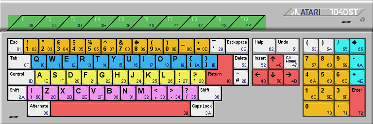

# BlitZwav

## [Cybernetics](https://cyber.savina.net)  
### Dok & Metal ages  
### 2022

-----------------------------------------------------------------------------------------------
## Changes

### Beta version
* [Released](https://files.scene.org/view/parties/2022/evoke22/alternative_platforms/blitzwav.zip) at [Evoke 22](https://2022.evoke.eu) in August 2022
* Not final content
* Menus crash on Mega STe
* [Glitch](https://youtu.be/ZRU6bvv_gJU?t=87) happening into menus on STe based on C300588 shifters

### Final version
* [Released](https://cyber.savina.net/products/products.htm) in November 2022
* Mega STe version fixed
* Menus glitch on C300588 shifters minimized ( not completely fixed unfortunately :| )
* Intro is now skipable by pressing SPACE key (except in compo mode)
* Add option in *Samscroll* effect to toggle curves drawing
* In *Sound shade* effect, inverse video mode filter now covers the whole screen borders in white
* Changes in content (sequences, musik, texts...)
* Works in STeem SSE

-----------------------------------------------------------------------------------------------
## Launch

* Run from floppy (Atari STe with at least 1mb)
    - from drive A : write BLITZWAV.ST image on a floppy, insert floppy into drive A, then reboot
    - from drive B : write BLITZWAV.ST image on a floppy, insert floppy into drive B, then run BOOTON_B.PRG from another drive
    - pressing ALT during boot period activates compo mode
    - pressing CTRL during boot period activates dma audio in playonce mode (may be useful with native NTSC STe)
    - ALT / CTRL color code in boot :
        * ALT > blue
        * CTRL > cyan
        * ALT + CTRL > magenta

* Run from hard drive (Atari STe with at least 2mb)
    - run BLITZWAV.TTP beside BLITZWAV.ST image from HD
    - no parameter: normal mode
    - 1 parameter: automatic compo mode
    - 2 parameters: dma audio with be in playonce mode (should be useful on native NTSC STe)
    - 3 parameters: automatic compo mode + dma audio in playonce mode (may be useful with native NTSC STe)
    - (parameter can get any value, only the number of parameters counts)

-----------------------------------------------------------------------------------------------
## Emulators

* With Hatari emulator, use keyboard in ***scancode*** mode
* A regression in DMA sound loop sync with Hatari 2.4 (works well in 2.3.1) fixed in 2.4.1 
-----------------------------------------------------------------------------------------------
## Interactive mode

* Function   (green)  keys : select screen when fx running in interactive mode (outside of main menu)
* Number     (orange) keys : usually related to voice fx 1 display selection
* Numpad     (orange) keys : usually related to voice fx 2 display selection
* 1st line   (blue)   keys : effects options
* 2nd line   (yellow) keys : effects options
* 3rd line   (pink)   keys : effects options
* Navigation (red)    keys : navigation keys for main menu or goback to menu
* Tone       (cyan)   keys : bass & treble tuning (into menus)

In this documentation, keys are named for a QWERTY keyboard => for other keyboards you have to use keys with other names but at the same position

-----------------------------------------------------------------------------------------------
## Main menu

* CURSOR KEYS to move
* SPACE / RETURN / ENTER to select
* NUMPAD + - tunes Bass microwire level
* NUMPAD / * tunes Treble microwire level
* When autorun mode activated : SPACE / RETURN deactivate autorun mode

-----------------------------------------------------------------------------------------------
## All FX screens

* Space / Return / Enter go back to menu
* Function key F1 -> F7 - go to a specific FX screen
-----------------------------------------------------------------------------------------------
## FX sound shade (F1)

### Numbers line
* 1 -> 4 : choose PCM voice to display with background colors (voice 1 2 4 3)
* 5 / 6  : activate / deactivate sample display into background colors (deactivate temporarily is useful when sync with musik)

### Numpad
* 1 -> 4 : choose PCM voice to display with overlay bitmap lines (voice 1 2 4 3)
* 7      : PCM overlay display no interlace
* 8      : PCM overlay display 1/4 or 2/3
* 9      : PCM overlay display 1/2/3/4

### Line 1
* QWERT : change feedback type for background colors 
    - Q : vertical
    - W : cross
    - E : rotate
    - R : zoom
    - T : no color feedback
* YU : force filling of colors background during one frame for flash effect (to sync with musik)
* I : when rotation FX active, direction is inverted every 32 frames. I enforce rotation change

### Line 2
* A -> F : choose overlay display mode
    - A  : no overlay
    - S  : display with two cycling colors
    - D  : display with one cycling color + grey
    - F  : display witch 2 grey colors

### Line 3
* \ -> M : change background colors post filter
    - \      : no post filter
    - Z -> M : assign various colors post filter
    - , -> . : activate / deactivate inverse video mode

-----------------------------------------------------------------------------------------------
## FX sample curves (F2)

### Numbers line
* 1 -> 4 : choose PCM voice to display (voice 1 2 4 3)
* 5 -> 7 : choose YM voice to display (voice 1 2 3)
* 9      : PCM display no interlace in curve
* 0      : PCM display 1/4 or 2/3 interlace
* _      : PCM display 1/3 or 2/1 or 4/2 or 3/4 interlace
* =      : PCM displat 1/2 or 2/4 or 4/3 or 3/1 interlace

### Numpad
* 1 -> 4 : choose PCM voice2 to display when available (voice 1 2 4 3)
* 5 -> 7 : choose YM voice2 to display when available (voice 1 2 3)

### Line 1
* QWER : choose between curve 
    - type 1 twins curves (bi color)
    - type 2 huge solo curve (mono color)
    - type 3 siamese curves (mono color)
    - type 1 + sparks effect (bi color)
* TYUIOP[ : tweak options on effect (for curve type 2)

### Line 2
* ASDF   : choose colors

-----------------------------------------------------------------------------------------------
## FX all curves (F3)

### Line 1
* QW : draw curves on / off
* E  : force cycle plane step

-----------------------------------------------------------------------------------------------
## FX sample scroll (F4)

### Numbers line
* 1 -> 4 : choose PCM voice to display in upper screen (voice 1 2 4 3)
* 5      : level 0 of samples is displayed
* 6      : level 0 of samples is not displayed
* 7      : toggle curves display

### Numpad
* 1 -> 4 : choose PCM voice to display in lower screen (voice 1 2 4 3)

### Line 1
* QWERT : display in upper screen BOING / BOOM / TSCHAK / PENG / ZONG
* YUIOP : display in lower screen BOING / BOOM / TSCHAK / PENG / ZONG

### Line 2
* A    : always display
* SDFG : display not every frame
* H    : set color cycling at start
* J    : set color cycling half
* K    : set color cycling at end
* L    : stop color cycling
* ;    : run color cycling

### Line 3
* \      : disable curve display
* Z      : enable normal curve display
* XCVBNM : curve display with crappy FX

-----------------------------------------------------------------------------------------------
## FX layerZ (F5)

### Numbers line
* 1 -> 4 : choose PCM voice to display (voice 1 2 4 3)
* 5 -> 7 : choose YM voice to display (voice 1 2 3)
* 9      : PCM display no interlace in curve
* 0      : PCM display 1/4 or 2/3 interlace
* _      : PCM display 1/3 or 2/1 or 4/2 or 3/4 interlace
* =      : PCM displat 1/2 or 2/4 or 4/3 or 3/1 interlace

### Numpad
* 1 -> 4 : choose PCM voice 2 to display (voice 1 2 4 3)
* 5 -> 7 : choose YM voice 2 to display (voice 1 2 3)

### Line 1
* QWERT : choose between curve 
    - type 1 twins curves
    - type 2 huge solo curve
    - type 3 siamese curves
    - type 4 keys
    - type 5 raw samples
* YUIOP : tweak options on effect (for curve type 2 & 3 - only L for 3)
* [     : flash

### Line 2
* ASDFG  : change fx / score overlay mode (XOR / OR / TOP score / TOP fx / SCORE off)
* HJKL;  : color cycle step 0,1,2,3,4
* '      : color cycle on / off

### Line 3
* \ZXCVBNM : display bitmap
* ,./      : change bitmap overlay (XOR / OR / TOP)

-----------------------------------------------------------------------------------------------
## FX SpaceWav (F6)

### Line 1
* QWE : change starfield speed

### Line 2
* ASDF : color flash (Red / Green / Blue / White)

-----------------------------------------------------------------------------------------------
## FX WavHero (F7)

### Numbers line
* 1: colors feed on
* 2: colors feed off

### Line 1
* QWE : change starfield speed

### Line 2
* AS : select colors projection type

-----------------------------------------------------------------------------------------------
## Dev version

Can be buggy...
* Backspace : step track index -1
* Tab       : step track index +1
* Clr home  : restart track
* Insert    : restart current pattern
