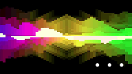

# demOS
demOS is a framework to develop demos or demos tool for Atari ST in C + ASM 68k

Products based on demOS...

## Rebirth - Cybernetics - 2015

Atari STe 8mhz

* 1+ mb & 2 floppy drives

or

* 2+ mb & 1 floppy drive

Releases

* RC7 - released at Sommarhack convention 4th July 2015
* RC8 - released 20th July 2015

Add data precache feature: if you have at least 2mb of RAM but only 1 floppy drive you can now run Rebirth	
maybe it can also solve problems for people having floppy timing problems

* in this case just keep your second floppy drive switched off
* if you run Rebirth with the 2 floppy drives switched on, it will load as before (without precache)

  
[REBiRTH](https://youtu.be/iNbVcFThTxY)

## Ubi30 - Metal Ages - 2016

Atari STe 8mhz

* 1mb / 1 floppy

[Ubi30](https://youtu.be/Gbq4wI9HsEw)

## Synthetic sound - Cybernetics - 2016

Prototype using blitter to mix PCM sounds on 2 voices (proof of concept)
	
[Synthetic sound](http://cyber.savina.net/sound.htm)

[Thread on Atari forum](http://www.atari-forum.com/viewtopic.php?f=16&t=29097)

## BLITSnd

4 voices replay routine using blitter to mix sound (around 16% VBL max)

* BLSconvert : convertion tool from .MOD format to .BLS format
* BLSplay : player using the routine

Have a look at DOCS/BLITsnd.md in the git depot for more info...

[BLITSnd](https://youtu.be/Xc0zv4YFitI)

## Todo list
* add CRC / RNF error management in FDC routine
